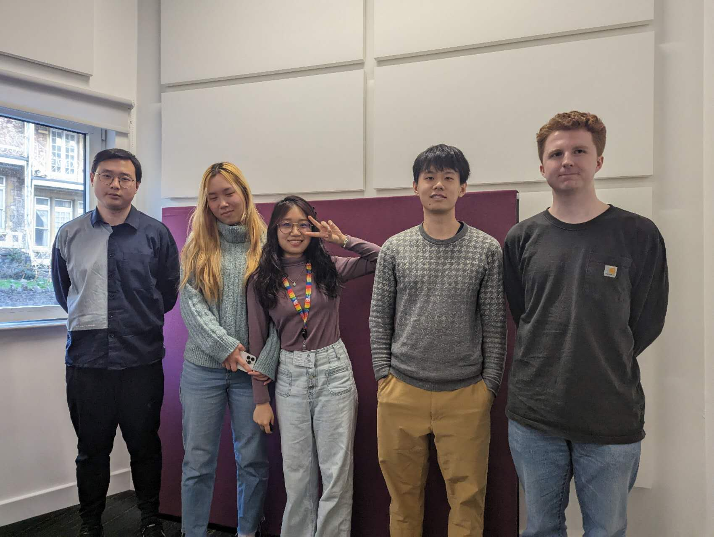
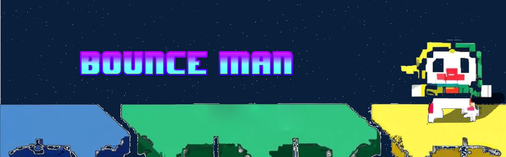

# 2023-group-17

| Group Members: |
| ------------- |
| Yutao Mo |
| Eamon Morrissey |
| Yujie Shi(Mason) |
| Haoyan Wang |
| Xinyue Zhang |

## Group Photo

# Project Report 

[Project video](https://uob-my.sharepoint.com/:v:/g/personal/al22575_bristol_ac_uk/ESUGfSegZaRKl_fmhdE9SJQB09dpaVYkpiloFHxTVytYhg?e=IrLoIp)

## Introduction 

Our game is a platformer where you must control a character and bounce from platform to platform while endlessly climbing higher and avoiding falling. There are no levels in this game, instead the platforms are randomly generated each session. As the player climbs higher their score increases. This is important for giving players a sense of achievement while also allowing for replayability as players want to try and get a higher score. 

Our game is based around Doodle Jump, released in 2009 originally for iOS devices.  The gimmick for our game is having the player constantly be chased by lava. This prevents the possibility of players idling for a long period of time and provides an incentive for them to move quickly. 

The appeal of the game comes from its simplicity. There are only two inputs, left arrow and right arrow. This means it is easily accessible for players of any skill level. Each play session is also very quick, only lasting a few minutes but with the possibility of lasting for an infinite amount of time. This makes it a suitable game to pick up and play quickly which was why the original Doodle Jump was such a huge success on mobile devices.

## Requirements 

As a team we decided we should make a casual game that would appeal to a mass audience. The big area of inspiration we looked to were mobile games. We devised a list of games we had all played at one point with an emphasis on listing games of different genres. 

| Game  | Genre |
| ------------- | ------------- |
| Bloons Tower Defense  | Strategy  |
| Temple Run  | Endless Runner  |
| Jetpack Joyride | Platformer |
| Fireboy and Watergirl | Co-op |
| Candy Crush | Puzzle | 

When narrowing down what game we should make we thought about our target demographic. We decide to come up with some user stories for a mass gamer audience:

“As a casual gamer I want a simple and fun experience”.

“As a regular gamer I want a challenge to overcome”.

“As an avid gamer I want to prove I am the best”.

Since we had identified our stakeholders we now needed a game that would best match their needs. 

Looking at the casual gamer audience we decided it would be a bad idea to make a strategy game with complicated mechanics. Though it may appeal to more dedicated gamers, a casual might be put off by having to dedicate a large amount of time to learning the game. A casual would be drawn to something with more instant gratification. We also ruled out the idea of a co-op game. This was because it would be less accessible to people if a second person was required to be able to play the game. 

This left us with the decision between puzzle and platformer style games. As a team we thought it would be more efficient to make a randomly generated game instead of building many individual levels. This ruled out puzzle games which would require complex levels to be developed. We decided on a platformer game that would include elements from endless runners. This would appease casual fans with its simple controls and pickup-and-play style. Regular games would have fun with a game that gets more difficult as it progresses. The game would also include a score, a staple of endless runners, which would allow avid gamers to compete to achieve the highest score. 

We decided to take inspiration from Doodle Jump. This was because we were encouraged to not make a 3d game, like temple run. We also thought a game where you progress by climbing up would be nice visual feedback for the player to see their character physically go up alongside their score. This as opposed to 2d platformers where they move horizontally. To appeal to the more hardcore gaming market we implemented a score system which gave users a direct measurement of how good they were at the game. As a group we also discussed the possibility of adding a database to save high scores which would allow for more comparison between players. 

We developed a case diagram for this proposed game:

The diagram emphasized the simple user interaction that we were aiming for. One button to start playing, then another to play again when there is a game over. It also includes a very simple settings menu. This additional difficulty option was also included for avid gamers looking for even more of a challenge. 

When deciding on a special gimmick for our version of Doodle Jump we looked at any issues we found in the original game. One problem was the option for player to be idle by bouncing on the same platform continuously. Though this meant the score would not increase we thought there was no real incentive for the player to keep moving at a faster pace. We decided to implement an object that would follow the player from below them, always forcing the player to move at a brisk pace and not staying at one spot for too long. This would also be good for a difficulty option as this object can be sped up or slowed down according to the player’s needs.

As a team we made a [paper prototype](PaperPrototype.mp4) to test out our game. This further solidified our game choice as we had a lot of fun playing our game. We showed our prototype to members of other groups and got positive feedback from our simple premise and fun game design.

## Design

When discussing the architecture of our game we decided it would be best to organize and plan our ideas through class and sequence diagrams. 

In our class diagram the game class is at the top of the hierarchy. It stores and sets the current game state. It also contains an array list of all the figures currently in the game. This means we can freely add and remove figures during gameplay. The screen class dictates what the player sees, including having a current score always present. As there is only one display for the player there is only one screen class present per game. The screen class also dictates the state of the game, setting the start screen upon launching the game and presenting a game over screen when the player loses. When a platform goes out of bounds the screen class will remove it from the array list where it will then be replaced by a new platform at the top of the screen. 

Creating the class diagram allowed everyone on the team to get an idea of the different aspects of the game that we would be making. We were able to organize and illustrate our ideas while getting a better understanding of how they relate together in a system structure. It was also important to make early on as it allowed us to brainstorm different methods and concepts for each class and decide which ones were not needed. For example, the scrollSpeed integer idea was dropped as we developed different ideas for moving the player upwards. 

For the figure class in our game, we created four sub classes. As these sub classes all interact with each other they have an association. For example, if the player class were to touch the platform class it would call the bounce function. They all inherit the x and y location attribute from the figure class as it allows each figure to have its own location on the screen. The platform subclass has multiple variations. For example, a platform that was destroyed and would fall if the player makes contact. Further inheritance classes were made to represent this. These classes would have their own individual methods to show their specialization.  Our idea was to have a set destroyed function in the destroyed platform class which, when active, would remove any collision detection between the player and platform. These subclasses would also inherit methods from the platform class, allowing them all to detect contact with the player in a similar way. 

Our sequence diagram was made to understand how each participant in the system interacts over a period of time when an event occurs in the game. In this sequence diagram we used the example of the player inputting a basic command to move the character. 

The user’s input sends the message to the screen that the character has moved. This method changes the x and y variables of the player class and is displayed on the screen. The player class must then come into contact with another figure, these being either the enemy or platform class. The use of the alternative interaction frames in a sequence diagram allows us to show these two outcomes. When the player comes into contact with a figure it must send a message to request the figure type. If it is an enemy then a game over is returned to the screen. The screen then returns a game over to the user. If the figure is a platform, no matter what type, it will return a bounce function to the screen. The figure then returns an updateLocation message to the player class so its x and y locations can be correctly updated to respresent that the chracter has moved upwards. 

Over time the player class exists until they reach a game over. At this point the user is only able to interect with the screen to start a new game or access the settings. The screen is always active as it is needed to constantly provide visual feedback to the user, letting them know where their character is on the screen as well as displaying the game over page. The figures are active only when they are being interacted with by the player. The figure types are identified when an individual figure is being displayed and when a figure type is being requested. When the updateLocation function is called the location of the figures move down to simulate the player is moving up. If a figure is out of bounds it will cease to exist.

These diagrams represent our initial plan for the game. As development started our game structure and many of the classes changed. 

## Implementation 

As we had decided to write all the code from scratch there were many areas of challenge for us. We decided on our three major challenges: 

1. Randomly generating platforms.
2. Implementing gravity physics.
3. Balancing the game difficulty

Originally our game was made in a 2d array. At the beginning of the game the array would be filled with platform pixels or clear pixels randomly. The platform pixels would act as a platform allowing the player to bounce from them while the clear pixels would act as the background. The player would then move from the bottom of the array to the top. When the player bounced off a platform the screen display would scroll upwards to continue to follow the player character while they travelled through the array. This was the basis of our first demo. However, we quickly realised this mechanism would not work.  The game contained an entire 2d array which would cost too many resources. We also found it difficult to implement smooth movement in an array made up of so few pixels.

To fix the generating platforms issue we decided to make an arraylist of platforms in the game class. An arraylist allows for contents to be freely added and removed when needed, unlike a 2d array which is set at the beginning. When the game starts twelve platforms are generated at random positions but never next to each other. As the player moves upwards and a platform goes out of bounds below the screen it is then removed from the arraylist and replaced by a new platform at the top of the screen. This means only twelve platforms exist at one time however it is simulated that there is an infinite number. No platforms are stored outside of the borders of the game. This would not be an issue as if the player character came into contact with the bottom of the game screen it would be considered a game over. 

When the player character is moving upwards and reaches the middle of the screen they stop moving, instead their velocity is transferred to the platforms. The platforms then move downwards, acting almost like a running machine where everything moves around the character to simulate movement upwards.  However, when the player is falling the platforms remain stationary. This is to allow the player to land on a platform or fall out of bounds which is essential for the game to be played.

The issue we now had to tackle was how to simulate gravity physics on the player character. In the player update() function the velocity of the player is increased. This velocity is then applied to the y location of the player character. This means each time the screen is refreshed the player falls at a faster rate than the last time it was refreshed to simulate gravity increasing the speed of the fall. When the player comes into contact with a platform the velocity is decreased. This means the player is moved upwards next time the screen is refreshed. The velocity is again decreased with each screen refresh, so the speed of the upwards movement is slowly being decreased until the character eventually starts to fall again.  

The final challenge was balancing the game. We had to decide the size of the player and platforms. We used the original Doodle Jump for reference. The platforms would take up roughly 1/8th of the screen and the character would be slightly smaller than the platform. We also decided to make the platforms thick enough to visually help the user as the platforms would stand out more. We also decided to have each platform type be visually different. Players seeing a green platform knew it was safe while a yellow platform was riskier. Enemy platforms were also added to bring some challenge to the game. We also had to choose the speed of the player character, both vertically and horizontally. This decision was tougher as it was something we couldn’t just see and decide was okay. 

As a team we played the game during each phase of development. This means everyone was able to give feedback on the difficulty. Our team is made up of casual, regular and avid gamers. This was especially important as we had feedback from all our stakeholders. During our evaluation phase we conducted further balance testing. We implemented a difficulty mode to make sure this game was suitable for all skill levels. After internal discussions we decided to remove the enemies and lava from the easy difficulty. This would give the player the chance to familiarize themselves with the premise and controls. With each difficulty increase an extra obstacle would be added to the game, with medium adding enemies and hard adding lava.

Eventually we came to a balancing decision we believe is challenging, fair and most importantly fun.

## Evaluation 

When we had a working prototype that we felt was a good representation of our game we decided to run a qualitative evaluation. This means we would be able to get some external feedback on our game. This feedback would help us improve current aspects of our game, as well as what areas we should focus most on during development. We decided on a heuristic evaluation based on the ten usability principles. Though we liked how quick, simple, and straight forward the think aloud evaluation was, we decided we wanted something that was more analytical.  

We chose three people as evaluators. We trained them to become experts by thoroughly explaining our game through its class and sequence diagrams and going over our design principles. This was a very quick training session as our game is fairly simple. We then made sure they were aware of the ten usability principles they were measuring. The evaluators then played the game for 30 minutes each. During this time the evaluators filled out a form with all their usability problems. These forms can be found [here](https://github.com/UoB-COMSM0110/2023-group-17/tree/main/Documents/Qualitative%20Evaluation).

The benefit to this method was how quickly we got our feedback. We found most of it to be very interesting. We were surprised that the evaluators struggled at first to understand the controls. This was something we deliberately made very simple and as such didn’t really include anything to inform the player on how to move the character. To respond to this, we decided to add some help text in the settings menu. This highlights how important it was to get feedback from someone outside of the dev team as our group may never have thought of this. A lot of the feedback was on areas we knew we had to improve. For example, the game presentation and aesthetics. At this point the game was made from simple shapes, so we had to make some good art assets to make everything look nicer. The aesthetics should also help with player feedback as they should be able to tell that each platform is different just by looking at them. The next most important feedback was for player visibility. We should be able to let players know their score when a game was over and be given to option to pause and restart the game. This was all something we worked to improve before the deadline. 

A quantitative evaluation is another useful tool in generating user opinions of our game. The best way to gather this information was through questionnaires. As a team we thought it would be better to use questionnaires that are used in the industry over generating our own. We chose the NASA TLX questionnaire over the System Usability questionnaire. Though both questionnaires had similar benefits we preferred the NASA TLX as we believed multiple scores would be more useful than a single SUS score.

For the NASA TLX questionnaire we allowed participants between 30 minutes and an hour to play the game, providing any feedback if they were stuck at any point. Afterwards we gave them the questionnaire to fill out. All the data was gathered and summed up, resulting in the table that can be found [here](https://github.com/UoB-COMSM0110/2023-group-17/tree/main/Documents/Quantitative%20Evaluation). 

From our data we find that people reacted positively to our simple game design. On average there was a very low level of frustration or effort among participants. This is especially important as the participants were playing our game for the first time. This means we had successfully made a game that could be played and enjoyed by anyone, including beginners. The average performance score of 51.5 suggests people felt they were successful where playing the game. This middling score could make some people frustrated as they may want an easier game that results in higher rates of success. However, it could also be seen that the game presents some form of challenge that may entice people to continue playing and improving. This difficulty in understanding a pure numbers dataset may be a negative to a qualitative evaluation. Whereas, with a qualitative evaluation you can read the participant’s exact opinions. The low mental and temporal demand with the game also suggests how beginner friendly it is as people are under low pressure and stress while playing. We were surprised by the high physical demand that participants felt. To combat this, we decided it might be a good idea to make the game more responsive to players controls. 

Though this feedback from our evaluations was very useful we would have like to have been able to gather data from different demographics and not just from students. 

These evaluations also double as black box testing. This is because the entire product was tested while the evaluators played the game. We also continued with our black box testing when we finished a new build with a debugging session where we tried to break the game. As for white box testing it was all done internally. Some functions such as that which checked for collision were tested to make sure they worked correctly. These tests were particularly hard to do as most of the code caused things to happen on the screen which is difficult to test for.   

## Process 

We decided on an agile approach to developing our game. This allowed us flexibility, changing many aspects of the design over the development period. After coming up with our game idea we decided on team roles. These roles did not last.  Instead, we allocated weekly tasks to each member. Making use of a kanban board we were able to keep track of what tasks we needed to start, what were currently in progress and what had been done. We used the kanbantools diagram website for the first month, however we lost access to it as it required a subscription. At our team meeting we went over our current game prototype. We discussed what worked and what needed fixing, with each member volunteering to do a job. As a group we tried to make sure everyone had their own specific area of the game they were experts on. We thought it would be more efficient if everyone had one part, they had focused all their time and effort on instead of jumping around to develop on different areas of the game. For example, a couple of people worked on the gameplay, someone worked on setting up the start screen while another worked on art assets. 

Within our meetings we also made use of pair programming, or more like group programming in our case. This meant we could brainstorm ideas while someone was able to input these ideas into the code, allowing us to test these ideas in real time. It was in these sessions that we were most productive, able to solve our coding challenges and come up with new ideas. This is one of the benefits of agile development as we were able to change our approach and restructure our priorities according to the usable product we had made. If this had been a waterfall development we would have followed the original plan and design the whole time and only been able to play the game at the final stage. I believe this would have resulted in an inferior product as we were unable to thoroughly test our game and make changes according to what we found. 

Between these meetings we used WhatsApp to keep in contact. We also set up a Microsoft Teams group. This allowed us to have virtual meetings during holidays. 

All the work was uploaded to our GitHub page once complete. At first this page was not very organized, with no clear plan on how to structure the page and what branches to use. Most people uploaded their work to a separate folder inside the main branch. This meant at multiple points we would have four or five separate games in the main branch. Eventually the page was cleaned up and everyone uploaded their work to one folder on the main branch. 

Our only conflict was when deciding if we should write the code in Processing or Java. The majority of the team thought it best to write it in Processing as that was what was requested in the task and it was a language we had all been learning over the weeks prior. At this point we had two versions of the game, one in Java and one in Processing. We also had other processing classes that had been written independently. Over the Easter break we decided as a group to scrap the Java version as it was not good enough.  We than combined all the processing classes and worked on this version as a team.

This is evidence of the lack of structure and direction from the team. Everyone did their own work independently in their own version of the game. This is the kind of problem that occurs when we don’t set team roles. If we had a lead programmer who oversaw the game itself and everyone else worked around them, we would never have had the issue of multiple projects being developed at once. Eventually when we settled on our language and basic game skeleton the team was able to work cohesively with everyone putting in a fair share of work.

## Conclusion

Through this project we experienced the challenges and triumphs that come with software development. We made the most of many techniques we learnt during the module to help with planning, developing and evaluating our game. We used class and sequence diagrams for the initial plan for the game. Using internal testing as well as qualitative and quantitative evaluations, we were able to modify and evolve these plans to meet with consumer and developed demands. This was all thanks to the flexibility offered by using an agile development cycle. 

To improve on this game, we would have like to add a global high score leaderboard feature. This was something we talked about for a while but never managed to implement. This would allow people to score their scores and even compare them to others. Both these features would be geared to more serious gamers. 

If we were to do this project again we would focus more on team roles. It would be important to have a lead developer, lead art designer and someone to organize the team admin. This would allow us to be more efficient as we are all working in the same direction. There was also poor levels of communication. Sometimes language barriers got in the way and there were points where some team members went missing after the end of terms. We would also have liked to have started development earlier. It wasn’t until Easter that we had a decent working product. However, this is the reality of student work. 

Overall, as a team we are very proud to have a working piece of software to show for it.  

In anticipation of our game reaching record sales, we will now begin planning on a sequel: 2Bounce2MAN (name not final). This version will include cutting edge 3d graphics and a multiplayer mode. We can also expand on the characters and lore, leading to more merch sales and eventually a cinematic universe. 
